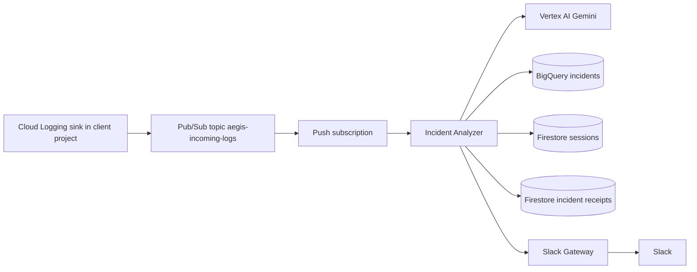

# Incident Analyzer — full specification and contracts

Document version: requirements triage (2026-05).

This document defines the target behavior of the `incident-analyzer` Cloud Run service in the newer Aegis Hub architecture, where Slack delivery is routed through `slack-gateway`.

---

## 1. Purpose and placement in Aegis Hub

The **Incident Analyzer** is a private Cloud Run service in the **Aegis Hub** project.

It receives exported error logs from Pub/Sub, normalizes them into the internal incident schema, performs Gemini-based analysis, seeds Firestore session state, sends a Slack alert payload to `slack-gateway`, and persists the final incident row in BigQuery with Slack handoff evidence when available.

It is the **first write owner** for:

- `aegis_incidents.incidents` in BigQuery
- `sessions/{incident_id}` in Firestore
- a separate Firestore deduplication receipt record

It does **not** talk to Slack directly in the target architecture.



### 1.1 Callers and non-callers

| Component | Calls Incident Analyzer? | Notes |
|-----------|---------------------------|-------|
| **Pub/Sub push subscription** | Yes | Primary event ingress |
| **Slack Gateway** | No | Separate path, only receives alert payloads from Analyzer |
| **Query Processor** | No | Reads session later, does not create incident |
| **End users / Slack / browser** | No | No public business endpoint |

### 1.2 Responsibilities vs other Hub services

| Responsibility | Owner |
|----------------|-------|
| Receive Pub/Sub push and decode wrapped message | **Incident Analyzer** |
| Parse and normalize Cloud Logging export | **Incident Analyzer** |
| Build and enforce idempotency key | **Incident Analyzer** |
| Run Gemini incident analysis | **Incident Analyzer** |
| Write incident row to BigQuery | **Incident Analyzer** |
| Create incident session in Firestore | **Incident Analyzer** |
| Create operational dedupe receipt in Firestore | **Incident Analyzer** |
| Post to Slack | **Slack Gateway** |
| Handle follow-up thread questions | **Query Processor** |

---

## 2. Transport model and why it is push

The service uses **Pub/Sub push delivery**, not a pull worker.

That means Pub/Sub sends an authenticated HTTP request to the Incident Analyzer Cloud Run URL whenever a message is ready.

This is already aligned with the current Terraform shape in `terraform/aegis-hub/pubsub.tf`, where the subscription pushes directly to the analyzer Cloud Run service URI.

This is acceptable and recommended for this project because:

- Cloud Run is naturally request-driven
- there is no need to run a long-lived poller
- scaling follows incoming event volume automatically
- Pub/Sub retry and DLQ behavior remain standard

---

## 3. External HTTP API

Base URL: Incident Analyzer Cloud Run service URI.

### 3.1 Required endpoints

| Method | Path | Purpose |
|--------|------|---------|
| `POST` | `/pubsub/push` | Main Pub/Sub delivery endpoint |
| `GET` | `/health` | Liveness |
| `GET` | `/ready` | Optional readiness |

### 3.2 Optional internal-only endpoints

These are useful for local development or authenticated debugging only.

| Method | Path | Purpose |
|--------|------|---------|
| `POST` | `/debug/parse-log` | Accept raw log JSON and return normalized incident draft |
| `POST` | `/debug/replay` | Replay a previously captured Pub/Sub wrapper |

These endpoints must be private and authenticated if implemented.

### 3.3 Authentication

`POST /pubsub/push` must only accept authenticated Pub/Sub push requests using Google OIDC identity tokens.

Expected caller identity is the dedicated Pub/Sub invoker service account configured in Terraform.

Business endpoints must not be publicly open.

---

## 4. Pub/Sub push contract

### 4.1 Request shape

Incident Analyzer receives the standard Pub/Sub push wrapper.

Example:

```json
{
  "message": {
    "data": "<base64-encoded-LogEntry-JSON>",
    "messageId": "2070443601311540",
    "publishTime": "2026-04-26T16:56:05.749Z",
    "attributes": {
      "logging.googleapis.com/timestamp": "2026-04-26T16:56:00Z"
    }
  },
  "subscription": "projects/aegis-hub/subscriptions/aegis-analyzer-sub"
}
```

### 4.2 Expected decoded payload

`message.data` is expected to decode into a Cloud Logging `LogEntry` export JSON or equivalent sink payload.

Analyzer must extract at minimum:

- source project
- resource type
- cluster name if present
- namespace if present
- service name if present
- pod name if present
- severity
- timestamp
- `insertId` if present
- main message and stack trace text if present
- labels if present
- structured `jsonPayload.incident_candidate`
- structured `jsonPayload.service_name`, `error_type`, `scenario`, and `stack_trace_preview` when present

Analyzer only creates incidents for logs that meet both conditions:

- severity is `ERROR`, `CRITICAL`, `ALERT`, or `EMERGENCY`
- structured payload contains `incident_candidate = true`

Logs that do not meet both conditions are acknowledged as ignored before receipt creation, Gemini calls, Slack handoff, or BigQuery writes.

### 4.3 Success response to Pub/Sub

Return `2xx` only when the message reached an acceptable terminal state.

For this service, acceptable terminal states are:

- `SUCCESS`
- `PARTIAL_SUCCESS`
- safe duplicate redelivery already handled earlier

### 4.4 Failure response to Pub/Sub

Return non-`2xx` when the event should be retried.

Most importantly:

- if Slack Gateway handoff succeeds but BigQuery write fails, return failure so Pub/Sub retries
- retries must not create a second Slack alert
- retries must not create a second BigQuery incident row
- retries must not create a second Firestore session or second conversation seed

### 4.5 Dead letter behavior

If delivery fails repeatedly, Pub/Sub moves the message to the DLQ according to subscription policy.

Analyzer should produce enough structured logs to diagnose why the event became dead-lettered.

---

## 5. Processing pipeline

### 5.1 High-level steps

1. Validate authenticated Pub/Sub push request.
2. Parse wrapper and base64-decode the log entry.
3. Extract normalization inputs from the raw log.
4. Ignore non-error or non-candidate logs before any downstream write or AI call.
5. Build idempotency key and check the dedupe receipt store.
6. If the receipt shows all downstream milestones completed, skip all downstream work and return success.
7. Generate a new human-readable `incident_id`.
8. Run Gemini step 1 to sanitize and normalize the log into internal incident schema fields.
9. Run Gemini step 2 to classify, explain, and recommend.
10. Run Gemini step 3 to generate Slack-ready alert text.
11. Create Firestore `sessions/{incident_id}`.
12. Send alert payload to Slack Gateway.
13. Write the final incident row to BigQuery with Slack channel/timestamp evidence when Gateway returned it.
14. Mark each completed milestone on the Firestore receipt.
15. Mark final terminal status and finish.

### 5.2 Rule ordering

The ordering matters.

The implemented order is:

- receipt claim or resume before any downstream side effect
- non-candidate filtering before receipt claim
- Firestore session creation before Slack handoff
- Slack handoff before final BigQuery persistence
- BigQuery persistence before final success acknowledgment

This preserves your chosen rule:

- a retry should reuse the same `incident_id`
- no duplicate BigQuery row
- no duplicate session creation
- no duplicate Slack alert after Slack Gateway already accepted the alert

---

## 6. Incident identity and deduplication

### 6.1 Incident ID format

Incident IDs must be human-readable because they appear in Slack and are later used in user interactions.

Recommended format:

`INC-YYYY-NNNNNN`

Example:

`INC-2026-000041`

The exact sequence generation mechanism is implementation-defined, but the output must be stable and readable.

### 6.2 Idempotency meaning

A Pub/Sub redelivery of the **same original log event** must not create a new incident.

A similar error that happens later as a genuinely new event must create a new incident.

### 6.3 Recommended idempotency key source

Recommended source fields:

- `client_project_id`
- `source_log_insert_id` from Cloud Logging `insertId`
- source event timestamp
- `pod_name`

Suggested key shape before hashing:

`client_project_id + insertId + timestamp + pod_name`

If `insertId` is absent, fallback construction is implementation-defined, but must be deterministic and conservative.

### 6.4 Operational dedupe store

Use a **separate Firestore collection** for retry protection.

Recommended collection:

`incident_receipts`

Recommended document id:

`{idempotency_key}`

This must be separate from `sessions` because delivery state and conversation state are different concerns.

### 6.5 Duplicate redelivery handling

If a receipt already exists for the same `idempotency_key` and all downstream milestones completed:

- do not create a new `incident_id`
- do not insert a new BigQuery row
- do not create a new Firestore session
- do not send a second Slack alert
- return success to Pub/Sub

If a receipt exists but some downstream milestone is still false, Analyzer must treat the message as a retry and resume from the first missing step.

BigQuery remains **one row per real incident occurrence**, not one row per retry.

---

## 7. Gemini contracts

Gemini is required in this service and should be split into specialized steps.

### 7.1 Gemini step 1 — sanitize and normalize

Purpose:

- sanitize raw log content
- extract structured incident fields
- produce a normalized internal incident draft

Inputs:

- raw decoded log payload
- selected metadata from Pub/Sub and Cloud Logging

Outputs:

- `error_type`
- `short_message`
- `stack_trace_preview`
- sanitized labels or summary fields
- normalized service and resource hints if needed

This step must avoid storing full raw stack traces when not necessary.

### 7.2 Gemini step 2 — classify and recommend

Purpose:

- analyze the sanitized incident
- explain likely cause
- produce recommendation text

Outputs:

- `ai_summary`
- `ai_recommendation`
- optional machine-usable classification tags

### 7.3 Gemini step 3 — Slack-ready text

Purpose:

- convert the incident record into final user-visible alert text

Output:

- `formatted_message`

This is the primary message Slack Gateway should post if analysis succeeded.

### 7.4 Fallback when Gemini fails

If Gemini fails partially or fully, Analyzer must still try to notify Slack with fallback text.

Minimum fallback alert must contain:

- `incident_id`
- `client_project_id`
- `service_name`
- `severity`
- short raw or sanitized summary
- sentence saying analysis is unavailable

Example shape:

`Incident INC-2026-000041 in mock-client-dev/java-api with severity ERROR was detected, but AI analysis is currently unavailable.`

---

## 8. BigQuery contract

### 8.1 Dataset and table

Use:

- dataset: `aegis_incidents`
- table: `incidents`

This already exists in `terraform/aegis-hub/bigquery.tf`.

### 8.2 Write model

BigQuery is **one row per real incident occurrence**.

It is not one row per Pub/Sub delivery attempt.

Duplicate redeliveries must be skipped after the receipt confirms that BigQuery, Firestore session creation, and Slack handoff all completed.

### 8.3 Existing table schema

Current Terraform schema includes these key fields:

- `incident_id`
- `idempotency_key`
- `event_id`
- `source_log_insert_id`
- `client_project_id`
- `resource_type`
- `cluster_name`
- `namespace`
- `service_name`
- `pod_name`
- `severity`
- `error_type`
- `short_message`
- `stack_trace_preview`
- `labels_json`
- `ai_summary`
- `ai_recommendation`
- `slack_channel`
- `slack_message_ts`
- `created_at`
- `hub_received_at`
- `incident_persisted_at`
- `first_alert_sent_at`
- `ai_summary_completed_at`
- `processing_completed_at`
- `terminal_status`
- `terminal_failure_reason`

### 8.4 Expected usage of selected fields

| Field | Meaning in Analyzer flow |
|-------|---------------------------|
| `incident_id` | Human-readable incident identifier |
| `idempotency_key` | Stable dedupe key for same real event |
| `source_log_insert_id` | Cloud Logging `insertId` if available |
| `stack_trace_preview` | Sanitized, truncated trace or log preview |
| `ai_summary` | Gemini step 2 summary |
| `ai_recommendation` | Gemini step 2 recommendation |
| `slack_channel` | Optional value if known later from Gateway |
| `slack_message_ts` | Optional value if returned later from Gateway |
| `terminal_status` | `SUCCESS`, `PARTIAL_SUCCESS`, or `FAILED` |
| `terminal_failure_reason` | Machine-readable reason for non-success |

### 8.5 Terminal status rules

Recommended statuses:

- `SUCCESS`
- `PARTIAL_SUCCESS`
- `FAILED`

Definitions:

- `SUCCESS`: BigQuery persisted, Firestore session created, Gemini produced details, Slack Gateway accepted normal alert payload
- `PARTIAL_SUCCESS`: BigQuery persisted and Slack Gateway received at least fallback alert, but some enrichment step failed
- `FAILED`: event did not reach the minimum acceptable state

### 8.6 Retry interaction with BigQuery

If BigQuery row was already written for the real incident and a retry comes later:

- Analyzer must detect the receipt
- Analyzer must skip the second BigQuery write

The dedupe receipt store is the operational source of truth for retry suppression.

Analyzer also performs a defensive BigQuery lookup by `idempotency_key` before inserting. This protects the demo path if a previous delivery wrote the row but failed before updating the Firestore receipt.

---

## 9. Firestore contracts

### 9.1 `sessions` collection

Document id must be:

`{incident_id}`

One session exists per incident.

Slack thread identifiers are not the primary key.

### 9.2 Session creation timing

Analyzer creates the Firestore session before Slack delivery and before the final BigQuery insert.

This ensures that retries reuse the same `incident_id` and do not create a second conversation seed.

### 9.3 Minimum session shape

```json
{
  "incident_id": "INC-2026-000041",
  "client_project_id": "mock-client-dev",
  "service_name": "java-api",
  "cluster_name": "mock-gke-autopilot",
  "namespace": "default",
  "severity": "ERROR",
  "error_type": "OutOfMemoryError",
  "ai_summary": "Java heap OOM in java-api pod",
  "messages": [
    {
      "role": "model",
      "content": "Incident INC-2026-000041: java-api reported OutOfMemoryError. Initial AI summary: ..."
    }
  ],
  "created_at": "2026-04-26T16:56:05Z",
  "log_timestamp": "2026-04-26T16:56:00Z",
  "updated_at": "2026-04-26T16:56:05Z",
  "ttl": "2026-04-27T16:56:05Z"
}
```

`log_timestamp` is the timestamp from the original Cloud Logging entry. Query Processor uses it to query Cloud Monitoring around the real incident time.

### 9.4 `incident_receipts` collection

Recommended document id:

`{idempotency_key}`

Recommended document shape:

```json
{
  "idempotency_key": "sha256:...",
  "incident_id": "INC-2026-000041",
  "client_project_id": "mock-client-dev",
  "source_log_insert_id": "abc123",
  "source_timestamp": "2026-04-26T16:56:00Z",
  "pod_name": "java-api-7f9c",
  "analysis_completed": true,
  "bigquery_persisted": true,
  "session_created": true,
  "slack_handoff_succeeded": true,
  "slack_channel": "C0123456789",
  "slack_message_ts": "1710000000.000100",
  "first_alert_sent_at": "2026-04-26T16:56:08Z",
  "created_at": "2026-04-26T16:56:05Z",
  "updated_at": "2026-04-26T16:56:20Z",
  "ttl": "2026-04-27T16:56:05Z"
}
```

Purpose:

- block duplicate incident creation on retry
- preserve the original `incident_id`
- track partial progress during retries

### 9.5 Firestore write semantics

Recommended behavior:

- create receipt record as early as safe for dedupe ownership
- update receipt as each downstream milestone completes
- create `sessions/{incident_id}` only once
- extend TTL if needed during retry recovery

---

## 10. Slack Gateway integration contract

Analyzer does not talk to Slack directly.

Slack Gateway decides where to post the alert.

### 10.1 Direction

`Incident Analyzer -> Slack Gateway`

### 10.2 Recommended internal endpoint

Recommended private endpoint:

`POST /v1/internal/incidents/alert`

This endpoint should be authenticated with Google identity tokens and invoker IAM, similar to other internal Cloud Run calls.

### 10.3 Recommended request payload

```json
{
  "incident_id": "INC-2026-000041",
  "client_project_id": "mock-client-dev",
  "service_name": "java-api",
  "severity": "ERROR",
  "error_type": "OutOfMemoryError",
  "short_message": "Java heap space",
  "sanitized_stack_trace_preview": "java.lang.OutOfMemoryError: Java heap space ...",
  "ai_summary": "The service likely exhausted heap memory after a recent spike.",
  "ai_recommendation": "Inspect memory limits and recent deploy changes.",
  "formatted_message": "*Incident* INC-2026-000041 ...",
  "fallback_text": "Incident INC-2026-000041 in mock-client-dev/java-api with severity ERROR was detected, but AI analysis is currently unavailable."
}
```

### 10.4 Gateway behavior

Gateway responsibilities:

- choose Slack destination channel from `DEFAULT_SLACK_CHANNEL_ID` (Analyzer must not send `channel_id`)
- post `formatted_message` when present
- otherwise post `fallback_text`
- optionally return Slack posting metadata later

Analyzer must not include `channel_id` or `thread_ts` in the alert payload.

### 10.5 Success criteria for Analyzer

Analyzer may treat Slack handoff as successful when Gateway accepts the request and confirms it has enough data to post.

Whether Gateway returns final `slack_message_ts` synchronously is implementation-defined.

---

## 11. Retry and acknowledgment rules

### 11.1 Ack success cases

Analyzer should return `2xx` to Pub/Sub when:

- duplicate redelivery was safely recognized and skipped
- or full incident processing succeeded
- or partial success was achieved

### 11.2 Partial success rule

Your chosen definition of `PARTIAL_SUCCESS` is:

- BigQuery write succeeded
- Slack still received some alert payload, at least fallback text
- some enrichment step such as Gemini failed

This is still acceptable to acknowledge to Pub/Sub.

### 11.3 Retry-required failure rule

If Slack Gateway accepted the alert but BigQuery persistence failed, Analyzer should return failure so the message is retried.

On retry:

- no second Slack alert
- no second BigQuery row
- no second Firestore session
- no second initial conversation seed
- same `incident_id` reused

### 11.4 Example retry matrix

| Firestore session | Slack handoff | BigQuery | Result | Pub/Sub ack |
|-------------------|---------------|----------|--------|-------------|
| Fail | No | No | retry path | No |
| Success | Fail | No | retry path | No |
| Success | Success | Fail | retry path | No |
| Success | Success with fallback | Success | `PARTIAL_SUCCESS` | Yes |
| Success | Success with full message | Success | `SUCCESS` | Yes |
| Already handled | Already handled | Already handled | duplicate redelivery | Yes |

---

## 12. Sanitization and storage policy

Full raw stack trace storage is not recommended.

Accepted rule:

- BigQuery may store a sanitized stack trace or sanitized log preview
- Firestore conversation seed may contain sanitized log context because Gemini output will be used later by Query Processor

Non-goals for now:

- no mandatory secret masking requirement
- no raw unbounded log dump storage

Recommended practical constraints:

- truncate very long previews
- store the most relevant error region only
- prefer plain text over deeply nested raw JSON in session messages

---

## 13. Environment variables

### 13.1 Required

| Variable | Purpose |
|----------|---------|
| `GCP_PROJECT` | Hub project id |
| `GCP_REGION` | Region for Vertex and service config |
| `ENVIRONMENT` | Environment label |
| `BIGQUERY_DATASET` | BigQuery dataset |
| `BIGQUERY_INCIDENTS_TABLE` | BigQuery table |
| `FIRESTORE_DATABASE` | Firestore database |

### 13.2 Recommended additions

| Variable | Purpose |
|----------|---------|
| `SLACK_GATEWAY_URL` | Internal Slack Gateway base URL |
| `VERTEX_MODEL` | Gemini model id |
| `SESSION_TTL_HOURS` | Session retention window |
| `RECEIPT_TTL_HOURS` | Dedupe receipt retention window |

### 13.3 Should not belong to Analyzer in target architecture

These should not be required by Analyzer once architecture is aligned fully:

- `SLACK_BOT_TOKEN_SECRET`
- direct Slack webhook tokens
- public Slack request verification secrets

---

## 14. Operational notes

- Analyzer is asynchronous and retry-tolerant.
- Pub/Sub retry is expected and must be harmless due to receipt-based dedupe.
- Firestore receipts are operational state, not user-facing conversation data.
- Query Processor later depends on the session created here.
- `incident_id` must always be included in Slack alerts because later app mentions use it.

---

## 15. Open implementation details

These are still implementation choices, not unresolved product rules.

| Topic | Current decision |
|-------|------------------|
| Incident id sequence generator | Deferred to implementation |
| Exact Gemini prompts | Deferred to implementation |
| Whether Slack Gateway returns `slack_message_ts` synchronously | Deferred to implementation |
| Receipt creation timing before or immediately after initial dedupe check | Deferred to implementation |
| Exact truncation limit for stack trace preview | Deferred to implementation |

---

## 16. Related documents

- `AGENTS.md` — newer architecture and service ownership
- `docs/query-processor-spec.md` — downstream session and query flow
- `.llm_context/Aegis_AI_M1_Checkpoint_with_Firebase.md` — original project document
- `terraform/aegis-hub/pubsub.tf` — Pub/Sub push subscription wiring
- `terraform/aegis-hub/bigquery.tf` — current BigQuery schema
- `terraform/aegis-hub/cloudrun.tf` — current Cloud Run env wiring
