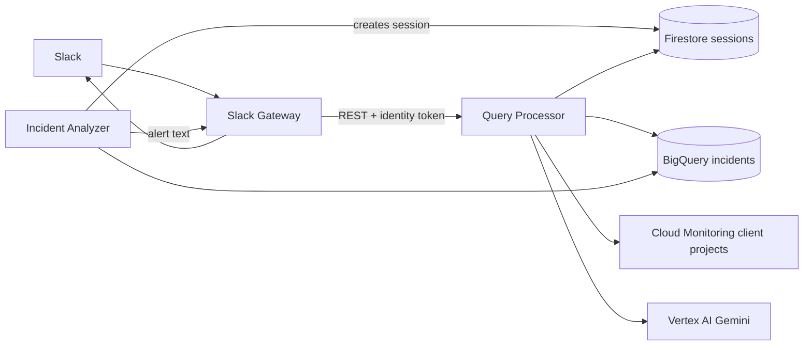
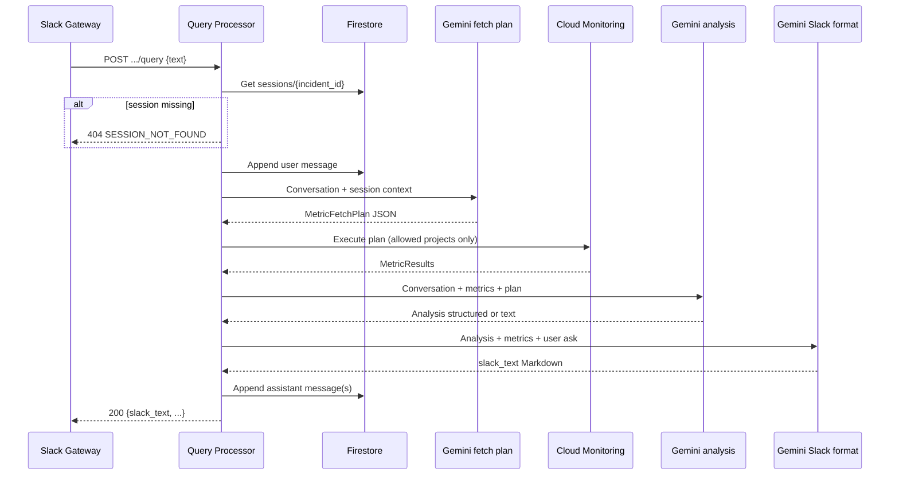

# Query Processor — full specification and contracts

Document version: requirements triage (2026-05).  
Replaces the M1 **Metrics Service** role; Terraform may still use service name `aegis-metrics-service` until renamed.

---

## 1. Purpose and placement in Aegis Hub

The **Query Processor** is a private Cloud Run service in the **Aegis Hub** project. It answers operator questions about monitored client workloads by combining:

- **Firestore** session state (per `incident_id`) for multi-turn chat,
- **Vertex AI (Gemini)** for metric selection, analysis, and Slack-ready replies,
- **Cloud Monitoring** (cross-project, read-only) for live metrics,
- **BigQuery** (read-only) for the **latest incidents** list only.

It does **not** receive traffic from Slack, Pub/Sub, or end users directly.



### 1.1 Callers and non-callers

| Component | Calls Query Processor? | Notes |
|-----------|------------------------|--------|
| **Slack Gateway** | Yes (only HTTP client) | Forwards app-mention and `/aegis-latest-incidents` work as REST |
| **Incident Analyzer** | No | Seeds Firestore + BigQuery; alerts via Slack Gateway |
| **Pub/Sub / Client projects** | No | |

### 1.2 Responsibilities vs other Hub services

| Responsibility | Owner |
|----------------|--------|
| Slack request verification, 3s ack, `response_url`, posting messages | **Slack Gateway** |
| Pub/Sub push, log normalization, incident write to BigQuery, dedup, initial Slack alert payload | **Incident Analyzer** |
| Firestore session **creation** on first incident | **Incident Analyzer** |
| Firestore session **read/update** after creation | **Query Processor** |
| Gemini / Monitoring / BigQuery reads for user queries | **Query Processor** |
| Building final user-visible troubleshooting text (Markdown) for incident thread | **Query Processor** |
| Posting that text to Slack | **Slack Gateway** |

---

## 2. User-facing flows (via Slack Gateway)

Slack UX is owned by Slack Gateway. Query Processor exposes **two REST operations** that map to product behavior as follows.

| Slack behavior (product) | Query Processor operation |
|--------------------------|---------------------------|
| User **app mention** in context of an incident (passes `incident_id` + text) | `POST /v1/incidents/{incidentId}/query` |
| Slack slash command **`/aegis-latest-incidents`** (optional limit text) | `GET /v1/incidents/latest?limit=N` |

**Out of scope for Query Processor (MVP):** `/aegis status`, `/aegis explain`, `/aegis help`, and other slash commands besides **`/aegis-latest-incidents`**; thread/session mapping by Slack `thread_ts` (threads are **disregarded**; session key is **`incident_id` only**). Latest incidents are triggered only via `/aegis-latest-incidents`, parsed by Slack Gateway.

---

## 3. HTTP API (Slack Gateway → Query Processor)

Base URL: Cloud Run service URI (today: `aegis-metrics-service`; env on Gateway: `QUERY_PROCESSOR_URL`).

All paths prefixed with `/v1/`.  
**Content-Type:** `application/json` for bodies and responses.

### 3.1 Authentication and transport

- **Caller:** Slack Gateway (same Hub service account family: `aegis-bot-sa`).
- **Mechanism:** `Authorization: Bearer <Google OIDC identity token>` with audience = Query Processor Cloud Run URL.
- **IAM:** `roles/run.invoker` granted to the bot SA on the Query Processor service (see `terraform/aegis-hub/cloudrun.tf`).
- **Ingress:** Cloud Run accepts traffic per current Terraform (`INGRESS_TRAFFIC_ALL`); security relies on token + invoker, not public anonymous use for business endpoints.

Recommended Gateway headers on every call:

| Header | Value |
|--------|--------|
| `Authorization` | `Bearer <id_token>` |
| `Content-Type` | `application/json` |
| `X-Request-Id` | Optional UUID for correlation in logs |

### 3.2 Standard error envelope

For `4xx` / `5xx` (except empty `404` if you choose minimal body), body:

```json
{
  "error_code": "SESSION_NOT_FOUND",
  "message": "Human-readable explanation for logs and Gateway mapping",
  "incident_id": "INC-2026-000041",
  "request_id": "optional-uuid"
}
```

**Slack Gateway duty:** map `error_code` / HTTP status to a short Slack message (especially **404** — user must be told the incident/session is unknown).

| HTTP | `error_code` (suggested) | When |
|------|--------------------------|------|
| 400 | `INVALID_REQUEST` | Missing/empty `text`, `limit` out of range, malformed `incident_id` |
| 404 | `SESSION_NOT_FOUND` | No Firestore document `sessions/{incident_id}` |
| 403 | `PROJECT_NOT_ALLOWED` | Session references client project not in `ALLOWED_CLIENT_PROJECT_IDS` |
| 502 | `GEMINI_INVALID_PLAN` | Gemini #1 output fails JSON schema validation |
| 502 | `GEMINI_INVALID_RESPONSE` | Gemini #2 or #3 output unusable |
| 503 | `DEPENDENCY_UNAVAILABLE` | Firestore, Monitoring, BigQuery, or Vertex unreachable / timeout |
| 504 | `PROCESSING_TIMEOUT` | End-to-end processing exceeded internal deadline |

### 3.3 Health endpoints (implementation)

| Method | Path | Purpose |
|--------|------|---------|
| GET | `/health` | Liveness |
| GET | `/ready` | Optional readiness (deps not required for liveness) |

Not used by Slack; for Cloud Run / ops.

---

## 4. Operation A — Latest incidents (stateless, via `/aegis-latest-incidents`)

### 4.1 Purpose

Return the most recent **fully successful** incidents for display in Slack (e.g. numbered list with id, service, error, age). Rows with `PARTIAL_SUCCESS` or `FAILED` are excluded.

### 4.2 Request

```
GET /v1/incidents/latest?limit={n}
```

| Parameter | Type | Default | Rules |
|-----------|------|---------|--------|
| `limit` | integer query | **10** | `1 <= limit <= MAX_LIMIT` (recommend `MAX_LIMIT = 25`) |

No request body. No Firestore. No Gemini.

### 4.3 BigQuery contract

- **Dataset / table:** `aegis_incidents.incidents` (env: `BIGQUERY_DATASET`, `BIGQUERY_INCIDENTS_TABLE`).
- **Filter:** completed application incidents only:
  - `terminal_status = 'SUCCESS'`
  - severity is `ERROR`, `CRITICAL`, `ALERT`, or `EMERGENCY`
  - `error_type` is present
  - workload has `k8s-pod/app_kubernetes_io/part-of = aegis-ai` or is a known
    demo workload service (`java-api`, `python-api`, `python-worker`) for
    legacy rows created before the final label set
  - duplicate `incident_id` rows are collapsed to the newest row
- **Order:** `created_at DESC`.
- **Limit:** query parameter (default 10).

Example SQL shape:

```sql
SELECT
  incident_id,
  created_at,
  client_project_id,
  service_name,
  severity,
  error_type,
  short_message,
  ai_summary
FROM `{hub_project}.aegis_incidents.incidents`
WHERE
  terminal_status = 'SUCCESS'
  AND severity IN ('ERROR', 'CRITICAL', 'ALERT', 'EMERGENCY')
  AND error_type IS NOT NULL
  AND TRIM(error_type) != ''
  AND (
    JSON_VALUE(labels_json, '$."k8s-pod/app_kubernetes_io/part-of"') = 'aegis-ai'
    OR service_name IN ('java-api', 'python-api', 'python-worker')
  )
QUALIFY ROW_NUMBER() OVER (
  PARTITION BY incident_id
  ORDER BY created_at DESC
) = 1
ORDER BY created_at DESC
LIMIT @limit
```

### 4.4 Success response

**HTTP 200**

```json
{
  "limit": 10,
  "count": 3,
  "incidents": [
    {
      "incident_id": "INC-2026-000041",
      "created_at": "2026-04-26T16:56:00Z",
      "client_project_id": "mock-client-dev",
      "service_name": "java-api",
      "severity": "ERROR",
      "error_type": "OutOfMemoryError",
      "short_message": "Java heap space",
      "ai_summary": "Optional one-line from analyzer"
    }
  ]
}
```

| Field | Required | Description |
|-------|----------|-------------|
| `limit` | yes | Echo applied limit |
| `count` | yes | Length of `incidents` array |
| `incidents[].incident_id` | yes | Stable id for follow-up mentions |
| `incidents[].created_at` | yes | ISO-8601 UTC |
| `incidents[].client_project_id` | yes | For Gateway / user context |
| `incidents[].service_name` | yes | |
| `incidents[].severity` | yes | |
| `incidents[].error_type` | recommended | |
| `incidents[].short_message` | optional | |
| `incidents[].ai_summary` | optional | |

**Slack Gateway:** may format this JSON into Slack mrkdwn (Gateway owns list layout unless you later add `slack_text` here too).

### 4.5 Failure modes

| Condition | HTTP |
|-----------|------|
| Invalid `limit` | 400 |
| BigQuery error / timeout | 503 |

---

## 5. Operation B — Incident query (stateful, app mention)

### 5.1 Purpose

Handle a **follow-up user message** about a specific incident: load conversation, parse the provided text, plan metrics, fetch from Monitoring, analyze, produce **ready-to-post Slack Markdown**, persist turns in Firestore.

**Important:** `incident_id` is used to load **Firestore only**, not BigQuery, on this path. If the session does not exist, return **404** so Gateway can inform the user.

### 5.2 Request

```
POST /v1/incidents/{incidentId}/query
```

**Path**

| Segment | Description |
|---------|-------------|
| `incidentId` | Same id as BigQuery `incident_id` and Firestore document id |

**Body**

```json
{
  "text": "Why is memory still high after the restart?"
}
```

| Field | Required | Rules |
|-------|----------|--------|
| `text` | yes | Non-empty after trim; max length TBD (recommend 4000 chars) |

Slack Gateway extracts only `incident_id` and `text` from the app mention before calling Query Processor.

Optional future fields (not MVP): `slack_user_id`, `slack_channel_id` for audit only.

### 5.3 Processing pipeline (internal)



| Step | Model / system | Output |
|------|----------------|--------|
| 1 | Firestore read | Session document |
| 2 | Append user turn | Updated `messages[]` |
| 3 | **Gemini #1** | `MetricFetchPlan` (strict JSON) |
| 4 | **Cloud Monitoring** | `MetricResults` (deterministic executor) |
| 5 | **Gemini #2** | Root-cause analysis (structured or prose stored internally) |
| 6 | **Gemini #3** | Final **`slack_text`** (Markdown, consistent template) |
| 7 | Firestore write | Append model turn(s), `updated_at`, refresh `ttl` |
| 8 | HTTP response | `slack_text` + metadata |

**BigQuery on this path:** not required for MVP; incident context should already be in the session seeded by Incident Analyzer. Optional later: hydrate missing fields from BQ by `incident_id`.

**Cloud Logging:** MVP priority is **Monitoring only**; add Logging if cheap (e.g. recent ERROR count).

### 5.4 Success response

**HTTP 200**

```json
{
  "incident_id": "INC-2026-000041",
  "slack_text": "*Aegis* — java-api (mock-client-dev)\n\n**Status:** Memory still elevated...\n\n**Likely causes:**\n1. ...\n\n**Suggested checks:**\n- ...",
  "timestamp": "2026-04-26T16:56:28Z",
  "session_updated": true,
  "metrics_fetched": true,
  "processing_ms": 8420
}
```

| Field | Required | Description |
|-------|----------|-------------|
| `incident_id` | yes | Echo path id |
| `slack_text` | yes | **Final** Markdown (or mrkdwn-safe) string; Gateway posts as-is with minimal wrapping |
| `timestamp` | yes | ISO-8601 UTC when the response was generated |
| `session_updated` | yes | Firestore write succeeded |
| `metrics_fetched` | recommended | `false` if plan empty or Monitoring failed but degraded reply still sent |
| `processing_ms` | optional | Observability |

**Slack Gateway:** post `slack_text` to the thread/channel; do not re-run Gemini.

### 5.5 Slack text format (Gemini #3 contract)

Template should stay **consistent** turn-to-turn, for example:

1. Header: incident id + service + project  
2. **Observed metrics** (bullet list with values and window)  
3. **Analysis** (short paragraph)  
4. **Likely causes** (numbered)  
5. **Suggested next steps** (bullets)

Use Slack-compatible Markdown: `*bold*`, `_italic_`, bullets; avoid tables if unsupported in your posting API.

### 5.6 Failure modes

| Condition | HTTP | Gateway action |
|-----------|------|----------------|
| No `sessions/{incident_id}` | **404** | User-facing: unknown incident / no active session |
| Empty `text` | 400 | Usage hint |
| Client project not allowed | 403 | Config error message |
| Gemini #1 invalid JSON | 502 | Generic “try again” |
| Monitoring hard failure | 503 or 200 degraded* | *Product choice: prefer 503 for MVP |
| Gemini #2/#3 failure after metrics | 502 / 503 | Generic error |

---

## 6. Gemini contracts (Query Processor internal)

All Gemini calls use Vertex AI in the Hub project (`roles/aiplatform.user`). Prompts live in Query Processor code; Gateway has **no** Vertex access.

### 6.1 Gemini #1 — Metric fetch plan

**Input context:** Full `messages[]`, plus session fields:
`client_project_id`, `service_name`, `cluster_name`, `namespace`,
`pod_name`, `scenario`, `error_type`, `short_message`,
`stack_trace_preview`, `upstream_service`, `http_method`, `path`,
`status_code`, `ai_summary`, and `log_timestamp` when present.

**Output:** JSON matching **`MetricFetchPlan`** schema (validate before Monitoring calls; on failure return 502 `GEMINI_INVALID_PLAN`).

```json
{
  "version": 1,
  "window_minutes": 15,
  "metrics": [
    {
      "type": "cpu_utilization",
      "aggregation": "mean",
      "resource_label": "service_name",
      "resource_value": "java-api"
    },
    {
      "type": "memory_utilization",
      "aggregation": "max",
      "resource_label": "service_name",
      "resource_value": "java-api"
    },
    {
      "type": "pod_restart_count",
      "aggregation": "sum",
      "resource_label": "service_name",
      "resource_value": "java-api"
    }
  ],
  "rationale": "User asked about memory after restart; need CPU/memory and restarts."
}
```

| Field | Type | Rules |
|-------|------|--------|
| `version` | int | Must be `1` |
| `window_minutes` | int | `1–60` (cap in executor) |
| `metrics` | array | At least 1 item for MVP |
| `metrics[].type` | enum | MVP: `cpu_utilization`, `memory_utilization`, `pod_restart_count` |
| `metrics[].aggregation` | enum | `mean`, `max`, `min`, `sum` per type |
| `metrics[].resource_label` | string | e.g. GKE / monitored resource label key |
| `metrics[].resource_value` | string | Must align with session `service_name` unless user asked otherwise |
| `rationale` | string | For logs/debug; not shown in Slack directly |

**Executor behavior:** Map each `type` to concrete Cloud Monitoring MQL or time-series filters for the **client project** in session. Reject plans referencing disallowed projects. Unknown `type` → skip or 502.

Project and service for Monitoring calls come from **Firestore session**, not from free-form model text alone.

### 6.2 Gemini #2 — Root-cause analysis

**Input:** Conversation, `MetricFetchPlan`, raw `MetricResults`, session summary fields.

**Output:** Internal structure (example):

```json
{
  "summary": "Memory remains high while restarts suggest crash loop risk.",
  "likely_causes": [
    {"title": "Insufficient memory limit", "confidence": "medium"},
    {"title": "Leak after deploy", "confidence": "low"}
  ],
  "recommended_actions": ["Check limits", "Compare deploy time with metric spike"]
}
```

May be stored in Firestore as part of assistant `content` or a dedicated `last_analysis` field (implementation choice).

### 6.3 Gemini #3 — Slack formatter

**Input:** User text, conversation snippet, Gemini #2 output, `MetricResults`.

**Output:** Plain string → HTTP `slack_text`. No additional JSON wrapper required from the model; Query Processor assigns the string to the response field.

---

## 7. Firestore contract (`sessions` collection)

Database: Hub Firestore (`FIRESTORE_DATABASE` env, collection `sessions`, TTL on field `ttl` per `terraform/aegis-hub/main.tf`).

Document id: **`{incident_id}`** (e.g. `INC-2026-000041`). One session per incident; **Slack threads are not** session keys.

### 7.1 Incident Analyzer — create (write-once per incident)

When an incident is first processed and alerted, Incident Analyzer **must** create `sessions/{incident_id}` before or when the Slack alert is sent.

**Minimum recommended document:**

```json
{
  "incident_id": "INC-2026-000041",
  "client_project_id": "mock-client-dev",
  "service_name": "java-api",
  "cluster_name": "mock-gke-autopilot",
  "namespace": "default",
  "severity": "ERROR",
  "error_type": "OutOfMemoryError",
  "scenario": "JAVA_OOM",
  "short_message": "Java heap space",
  "stack_trace_preview": "java.lang.OutOfMemoryError: Java heap space ...",
  "upstream_service": "",
  "http_method": "GET",
  "path": "/api/work",
  "status_code": 500,
  "ai_summary": "Java heap OOM in java-api pod",
  "messages": [
    {
      "role": "model",
      "content": "Incident INC-2026-000041: java-api reported OutOfMemoryError. Initial AI summary: ..."
    }
  ],
  "created_at": "2026-04-26T16:56:05Z",
  "updated_at": "2026-04-26T16:56:05Z",
  "ttl": "2026-04-27T16:56:05Z"
}
```

| Field | Set by | Purpose |
|-------|--------|---------|
| `incident_id` | Analyzer | Redundant with doc id; validation |
| `client_project_id` | Analyzer | Monitoring cross-project target |
| `service_name` | Analyzer | Monitoring resource scope |
| `cluster_name`, `namespace` | Analyzer | Optional Monitoring labels |
| `severity`, `error_type` | Analyzer | Context for Gemini |
| `scenario`, `short_message`, `stack_trace_preview` | Analyzer | Concrete incident signal for follow-up answers |
| `upstream_service`, `http_method`, `path`, `status_code` | Analyzer | Dependency and HTTP context for root-cause analysis |
| `ai_summary` | Analyzer | Short alert summary |
| `messages` | Analyzer (initial), QP (append) | Gemini conversation |
| `created_at`, `updated_at` | Analyzer / QP | Bookkeeping |
| `ttl` | Analyzer | 24h TTL policy |

### 7.2 Query Processor — read/update

- **Read** at start of `POST .../query`.
- **Append** `{ "role": "user", "content": "<text>" }` after validation.
- **Append** `{ "role": "model", "content": "<slack_text or summary>" }` after Gemini #3 (may also persist structured analysis).
- **Update** `updated_at` and extend `ttl` on each successful turn.
- **Never** create a new session document (404 if missing).

### 7.3 Slack Gateway

**No Firestore access** in target architecture.

---

## 8. Cloud Monitoring contract (client projects)

- **Identity:** Hub `aegis-bot-sa` with `roles/monitoring.viewer` on each client project (`terraform/client-agent/iam.tf`).
- **Allowlist:** Env `ALLOWED_CLIENT_PROJECT_IDS` (comma-separated). Query Processor must refuse sessions pointing at other projects.
- **MVP metrics:** CPU limit utilization, CPU request utilization, CPU core usage, memory used bytes, memory limit utilization, and pod restart count for GKE workloads matching `service_name`, `namespace`, `cluster_name`, and `pod_name` in session.
- **Incident-time anchor:** Query Processor uses `sessions/{incident_id}.log_timestamp` when present, falling back to `created_at`. Monitoring windows are anchored to the actual client log time, not the time when a Slack user asks the question.
- **Deterministic facts:** Slack responses prepend deterministic CPU/memory/restart facts computed from Cloud Monitoring before Gemini-written explanation text. Gemini must not invent metric values.
- **Data retention:** Use provider defaults; do not duplicate time series in Hub storage.

Optional later: `roles/logging.viewer` for recent ERROR log lines (low priority).

---

## 9. BigQuery contract (read-only)

| Operation | Uses BQ? | Table |
|-----------|----------|--------|
| Latest incidents | Yes | `aegis_incidents.incidents` |
| Incident query | No (MVP) | — |

Hub bot roles: `bigquery.dataEditor`, `bigquery.jobUser` (shared SA; Query Processor only **SELECT** for latest incidents).

---

## 10. Slack Gateway integration summary

### 10.1 Gateway → Query Processor

| Slack trigger (product) | HTTP call |
|-------------------------|-----------|
| Slash command `/aegis-latest-incidents` | `GET /v1/incidents/latest?limit=N` |
| App mention with `incident_id` + user text | `POST /v1/incidents/{incidentId}/query` |

Gateway responsibilities:

1. Parse Slack payload only enough to extract `incident_id` and `text`.
2. Obtain identity token for Query Processor URL.
3. Call REST; on **404**, send Slack message: session/incident not found (exact copy is product wording).
4. On **200** for query: post `slack_text` via Slack Web API.
5. On **200** for latest: format `incidents[]` for Slack (unless spec later adds `slack_text` on that endpoint too).
6. Map `5xx` / `502` to short user errors.

### 10.2 Incident Analyzer → Slack Gateway (out of band)

Query Processor is not in this path. Documented for context: Analyzer sends alert text to Gateway (no `channel_id`; Slack Gateway picks the alert channel). Alert should include **`incident_id`** so users can mention the bot with that id.

---

## 11. Environment variables (Query Processor)

| Variable | Source (today) | Purpose |
|----------|----------------|---------|
| `GCP_PROJECT` | Hub project id | Vertex, Firestore, BQ |
| `GCP_REGION` | Region | Vertex region |
| `ENVIRONMENT` | dev/prod | Logging labels |
| `ALLOWED_CLIENT_PROJECT_IDS` | tfvars list | Cross-project guard |
| `FIRESTORE_DATABASE` | Firestore db id | Sessions |
| `BIGQUERY_DATASET` | `aegis_incidents` | Latest incidents |
| `BIGQUERY_INCIDENTS_TABLE` | `incidents` | Latest incidents |
| `VERTEX_MODEL` | optional | Gemini model id |

Slack secrets are **not** on Query Processor.

---

## 12. Explicitly out of scope

- Slack signing secret verification, Events API URL, `chat.postMessage`  
- Pub/Sub consumption and incident normalization  
- BigQuery **writes** and idempotency dedup store  
- Initial Firestore session creation  
- Slash commands other than `/aegis-latest-incidents` (e.g. `/aegis status`, `/aegis explain`, `/aegis help`) unless added later  
- Kubernetes API live pod listing (deferred in M1)  
- Session keyed by Slack `thread_ts`  
- Public/unauthenticated access to business APIs  

---

## 13. Operational notes

- **Latency:** Cross-project Monitoring + 3× Gemini may exceed Slack’s 3s window; Gateway must ack fast and post `slack_text` asynchronously when used from Events API.
- **Idempotency:** Retried `POST .../query` with same body may duplicate user turns; acceptable for MVP or dedupe by `X-Request-Id` later.
- **Rename:** Align Cloud Run service name, image var, and `QUERY_PROCESSOR_URL` in Terraform when implementing code under `aegis-hub-code/query-processor/`.

---

## 14. Open implementation details

| Topic | Decision deferred to implementation |
|-------|-------------------------------------|
| `MAX_LIMIT` for latest incidents | Suggest 25 |
| Max `text` length | Suggest 4000 |
| Degraded reply when Monitoring partial failure | 200 with `metrics_fetched: false` vs 503 |
| Persist Gemini #2 JSON vs only final `slack_text` in Firestore | Team choice |
| Exact Monitoring MQL per `MetricFetchPlan.type` | GKE Autopilot demo alignment |
| Add `slack_text` to latest-incidents response | Currently JSON only; Gateway formats |

---

## 15. Related documents

- `.llm_context/Aegis_AI_M1_Checkpoint_with_Firebase.md` — original Metrics Service / API (partially superseded)  
- `AGENTS.md` — architecture pivot (Query Processor, thin Gateway)  
- `terraform/aegis-hub/bigquery.tf` — incidents table schema  
- `terraform/aegis-hub/cloudrun.tf` — Cloud Run wiring  
